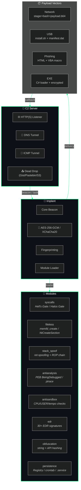

<div align="center">
  <picture>
    <source media="(prefers-color-scheme: dark)" srcset="https://capsule-render.vercel.app/api?type=waving&color=0:0d1117,50:00ff88,100:0d1117&height=200&section=header&text=HiveMind&fontSize=70&fontColor=00ff88&animation=fadeIn&fontAlignY=35">
    <source media="(prefers-color-scheme: light)" srcset="https://capsule-render.vercel.app/api?type=waving&color=0:ffffff,50:00cc77,100:ffffff&height=200&section=header&text=HiveMind&fontSize=70&fontColor=00cc77&animation=fadeIn&fontAlignY=35">
    
  </picture>
  <br>
  
  <br><br>
  <p><b>HiveMind</b> — <i>formerly <code>hive-colony</code></i> — is a Rust-powered post-exploitation framework designed for lightweight implants, encrypted C2 beaconing, modular payload delivery, and cross-platform persistence.</p>
  <br>
  <p>
    <a href="https://github.com/Ruby570bocadito/HiveMind/actions"></a>
    <a href="https://github.com/Ruby570bocadito/HiveMind/releases"></a>
    <a href="LICENSE"></a>
    <a href="https://www.rust-lang.org"></a>
    <a href="https://github.com/Ruby570bocadito/HiveMind"></a>
    <a href="https://github.com/Ruby570bocadito/HiveMind/issues"></a>
  </p>
  <br>
  <p>
    <a href="docs/DEPLOYMENT.md">📦 Deployment</a> •
    <a href="docs/OPERATOR_GUIDE.md">🎮 Operator Guide</a> •
    <a href="docs/AGENTS.md">🤖 Agents</a> •
    <a href="docs/MITRE_MAPPING.md">🛡️ MITRE ATT&CK</a> •
    <a href="docs/EVASION.md">👻 Evasion</a>
  </p>
  <br>
  
</div>

<br>

## 📐 Architecture



<br>

## ⚡ Quick Start

```bash
# 1. Build the framework
cargo build --release --workspace

# 2. Generate all payloads
./scripts/deploy.sh all

# 3. Launch local colony
./scripts/launch_colony.sh

# 4. Build a monolithic payload (auto-extract)
./scripts/build_payload.sh
```

<br>

## 🧩 Module Matrix

| Module | Technique | Status |
|--------|-----------|--------|
| `syscalls` | Hell's Gate / Halos Gate / indirect syscall | ✅ Linux + Windows |
| `fileless` | `memfd_create` / `NtCreateSection` + `NtMapViewOfSection` | ✅ Linux + Windows |
| `stack_spoof` | ret-spoofing + ROP chain | ✅ Linux + Windows |
| `antianalysis` | PEB BeingDebugged / `ptrace` / `TracerPid` | ✅ Linux + Windows |
| `antisandbox` | USER / CPU / uptime checks | ✅ Linux + Windows |
| `edr` | 30+ EDR signatures (Defender, CrowdStrike, SentinelOne…) | ✅ Windows |
| `obfuscation` | String obfuscation + API hashing | ✅ |
| `persistence` | Registry Run / Startup / SchTasks / WMI / crontab / systemd | ✅ |
| `phoenix` | Adaptive hibernation + channel rotation | ✅ |
| `sleepmask` | Sleep mask with heap encryption + stack permutation | ✅ |
| `indirect_syscall` | Dynamic SSN resolution + syscall stub | ✅ |
| `etw_patch` | ETW / ETW-TI patching (3 techniques) | ✅ |
| `ppid_spoof` | PPID spoofing via `NtCreateUserProcess` | ✅ |
| `clr_hijack` | CLR (.NET) hijacking for in-memory C# execution | ✅ |
| `sgn_encode` | Shikata-Ga-Nai encoder | ✅ |

<br>

## 🌐 Communications

### Internal (Mesh)
```
Worker  ──┬───┐
Drone   ──┼───┼──── Shared Arena (shm_open / mmap) ────┐  sin red, sin puertos
Honeybee ─┘   │   16 slots lock-free, MessagePack, 8KB msgs
Weaver  ──────┘
```

### External (C2)
```
Queen ─── HTTP(S) ─── C2 Server
         ├── DNS Tunnel ─── (txt records)
         ├── ICMP Tunnel ─── (raw socket)
         └── Dead Drop ─── Gist / Pastebin / S3
Failover: Priority → Race → RoundRobin with exponential backoff
```

<br>

## 🛡️ MITRE ATT&CK Coverage

36+ techniques across 10+ tactics. [View full mapping](docs/MITRE_MAPPING.md).

| Tactic | Techniques |
|--------|-----------|
| **Execution** | T1059, T1204, T1106, T1569 |
| **Persistence** | T1547, T1053, T1546 |
| **Defense Evasion** | T1564, T1055, T1140, T1027, T1620, T1562, T1070 |
| **Credential Access** | T1056, T1555 |
| **Discovery** | T1082, T1083, T1057, T1012, T1069, T1046 |
| **Collection** | T1115, T1056, T1074 |
| **Command & Control** | T1071, T1573, T1572, T1008, T1571, T1095 |
| **Exfiltration** | T1041, T1567, T1029 |

<br>

## 📂 Project Structure

```
src/
├── queen/             # C2 server (HTTPS / DNS / ICMP / Dead Drop)
├── worker/            # Reconnaissance & EDR detection agent
├── drone/             # Lateral movement & SSH agent
├── honeybee/          # Final execution: encryption, wipe, exfil
├── weaver/            # Morphing / process hollowing agent
├── swarm/             # Auto-propagation & MARL target selection
├── common/            # Shared crypto, IPC, config
scripts/
├── deploy.sh          # Payload generator (4 vectors)
├── build_payload.sh   # Monolithic auto-extract payload
├── launch_colony.sh   # Local colony launcher (Docker)
└── obfuscate_pe.py    # PE obfuscator v2.2
```

<br>

## 🐳 Docker

```bash
docker compose up -d
docker compose logs -f
docker compose down
```

<br>

## 📋 Requirements

| Dependency | Version | Notes |
|------------|---------|-------|
| **Rust** | 1.70+ | Stable channel |
| **OpenSSL** | dev | `apt install libssl-dev pkg-config` |
| **Python** | 3.10+ | See `requirements.txt` |
| **Linux** | 3.17+ | Kernel with `shm_open` |
| **Docker** | latest | Optional |
| **Optional** | — | Ollama, nmap, mingw-w64 |

<br>

## ⚖️ License

Dual-licensed under [MIT](LICENSE-MIT) and [Apache 2.0](LICENSE-APACHE).

---

<div align="center">
  <br>
  
  <br><br>
  <sub>
    <b>⚠️ HiveMind is intended exclusively for <b>authorized security research</b> and <b>defensive education</b>.</b><br>
    Unauthorized use on systems without explicit written permission is prohibited.<br><br>
    <a href="https://github.com/Ruby570bocadito"></a>
    &nbsp;&nbsp;
    <a href="https://github.com/Ruby570bocadito/HiveMind/blob/master/docs/SECURITY.md"></a>
    &nbsp;&nbsp;
    <a href="https://github.com/Ruby570bocadito/HiveMind/blob/master/CONTRIBUTING.md"></a>
    <br><br>
    
    &nbsp;
    
    &nbsp;
    
    <br><br>
    <code>🐝 Built with Rust · HiveMind © 2024</code>
  </sub>
  <br>
  
</div>
