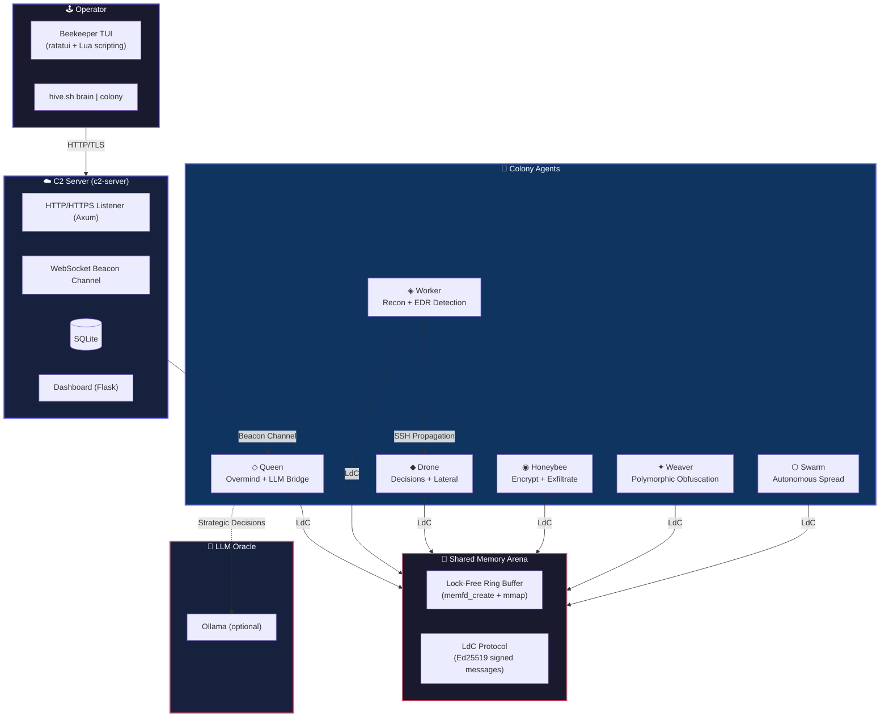

<p align="center">
  
</p>

<p align="center">
  <a href="https://git.io/typing-svg"></a>
</p>

<br>

<p align="center">
  
  
  
  
  
  
</p>

<br>

---

# 🧠 Hive Colony v3.0

> **A bee-inspired multi-agent autonomous swarm framework for Red Team operations.**  
> Six specialized agents collaborate via lock-free shared memory, spread laterally via SSH,
> evade EDRs through a 10-layer defense bypass stack, and execute under LLM strategic direction.

Hive Colony is **not** a traditional C2 + implant. It is a **self-organizing agent colony** where each agent type has a distinct role — reconnaissance, decision-making, execution, obfuscation, strategic planning, and autonomous propagation — all communicating through a shared memory arena without opening a single TCP port between them.

---

## 📡 Architecture



---

## 🐝 Agent Reference

| Agent | Icon | Role | Capabilities |
|-------|------|------|-------------|
| **Queen** | ◇ | **Overmind** — Estrategia LLM + C2 bridge | Ollama LLM integration, HiveMind consensus protocol, C2 bridge (HTTP/DNS/ICMP/Dead Drop), seer predictive modeling, failover |
| **Worker** | ◈ | **Scout** — Reconocimiento + EDR detection | System profiling (OS, arch, hostname, user), 30+ EDR signatures (CrowdStrike, Defender, SentinelOne, etc.), network enumeration, ML classification |
| **Drone** | ◆ | **Shaper** — Decisiones + movimiento lateral | Toma decisiones basadas en creencias, nmap/ARP scan, SSH lateral movement, regeneración de agentes caídos, modo colony agresivo |
| **Honeybee** | ◉ | **Hoarder** — Ejecución + exfiltración | AES-256-GCM encryption, 3-pass secure wipe, HTTP exfiltration, privilege escalation (SUID, sudo, Docker, PwnKit), cloud pivot (AWS, GCP, Azure) |
| **Weaver** | ✦ | **Morph** — Ofuscación polimórfica | 4 técnicas de mutación (XOR, NOP insertion, section shuffle, junk code), generación de variantes polimórficas |
| **Swarm** | ⬡ | **Worm** — Propagación autónoma | Auto-propagación vía SSH, MARL target selection, auto-limitación (max 10 hops, 2/min, 1h lifetime), self-destruct |

### 🧬 Comunicación: Shared Memory Arena

Todos los agentes se comunican a través de un **ring buffer atómico lock-free en memoria compartida** (`memfd_create` + `mmap`). **Cero puertos TCP. Cero sockets.** Mensajes firmados con **Ed25519**. Esto permite:

- **Invisibilidad en red** — no hay tráfico entre agentes que monitorear
- **Resiliencia** — si un agente muere, otro lo regenera vía Weaver
- **Velocidad** — comunicación en nanosegundos, sin serialización de red

---

## ✨ Features

| Feature | Description |
|---------|-------------|
| 🧠 **Multi-Agent Swarm** | 6 agentes especializados con roles distintos, no un monolito |
| 🔇 **Shared Memory IPC** | Zero TCP ports between agents — comunicación invisible |
| 🔒 **End-to-End Encryption** | AES-256-GCM + ChaCha20 + X25519 en toda la cadena |
| 🛡️ **10-Layer Evasion Stack** | Anti-debug, anti-sandbox, anti-VM, syscalls directos, memfd, stack spoofing |
| 🤖 **LLM Integration** | Queen usa Ollama para decisiones estratégicas |
| 🧩 **Polymorphic Engine** | Weaver muta binarios en 4 modos diferentes |
| 📊 **Operator Console** | Beekeeper TUI con scripting Lua, dashboard web |
| 🐳 **Docker Lab** | Entorno de laboratorio completo con victims, monitor, dashboard |
| 📈 **36 MITRE ATT&CK Techniques** | Mapeo completo de TTPs |

---

## 🚀 Quick Start

### Prerrequisitos

- **Rust** 1.70+ (instalar via [rustup](https://rustup.rs/))
- **OpenSSL** development headers (`libssl-dev`)
- **Python 3** (para dashboard y tests)
- Linux kernel 3.17+ (para `memfd_create`)
- Opcional: **Ollama** (para Queen LLM), **nmap** (para host discovery)

### Build

```bash
# Clonar
git clone https://github.com/Ruby570bocadito/HiveMind.git
cd HiveMind

# Build del C2 server
cargo build --release -p c2-server

# Build de todos los agentes
cargo build --release -p beekeeper -p stinger -p buzz
cargo build --release -p queen -p worker -p drone -p honeybee -p weaver -p swarm

# (O todos a la vez)
cargo build --release --workspace
```

### Ejecutar

```bash
# Modo operador (seguro — solo C2 + dashboard, sin ataques)
# Usando el script hive.sh (si existe)
./hive.sh brain

# Modo colonia (agresivo — ataca hosts alcanzables excepto safe_ips)
./hive.sh colony

# O manualmente:
./target/release/c2-server --port 8444 --db-path ./c2.db
./target/release/beekeeper
```

### Docker Lab

```bash
# Entorno de laboratorio completo con víctimas simuladas
docker compose up --build

# Escenario con múltiples víctimas SSH
docker compose -f docker-compose.lab.yml up --build
```

Esto levanta: `c2-server`, `queen`, `worker`, `drone`, `honeybee`, `weaver`, `swarm`, `victim`, `monitor`, `dashboard`, y opcionalmente `ollama`.

**Dashboard:** `http://localhost:8080`  
**C2 API:** `http://localhost:8443/health`

---

## 🛡️ 10-Layer Evasion Stack

| Layer | Technique | Module |
|-------|-----------|--------|
| 1 | Shared memory IPC (no TCP entre agentes) | `shared_arena` |
| 2 | Fileless execution (memfd_create) | `fileless` |
| 3 | Direct syscalls en ASM | `syscalls` |
| 4 | Call stack spoofing (synthetic RBP) | `stack_spoof` |
| 5 | XOR-encrypted ONNX models | `crypto` |
| 6 | Anti-debug (ptrace, TracerPid) | `anti_analysis` |
| 7 | Anti-sandbox (uptime, CPU, RAM) | `anti_analysis` |
| 8 | Anti-VM (DMI, CPUID, modules) | `anti_analysis` |
| 9 | String obfuscation at compile time | `obfstr!()` macro |
| 10 | Honey detection (bait files, honeypots, canary tokens) | `guardian` |

---

## 📦 Project Structure

```
HiveMind/
├── hive_base/          # 25 módulos compartidos (crypto, arena, ipc, ld, etc.)
├── agents/
│   ├── queen/          # ◇ Overmind — LLM + C2 bridge + consensus
│   ├── worker/         # ◈ Scout — recon + EDR detection
│   ├── drone/          # ◆ Shaper — decisions + lateral movement
│   ├── honeybee/       # ◉ Hoarder — encrypt + exfiltrate
│   ├── weaver/         # ✦ Morph — polymorphic obfuscation
│   └── swarm/          # ⬡ Worm — autonomous propagation
├── c2/                 # C2 Server (Axum + WS + SQLite)
├── beekeeper/          # TUI Operator Console (ratatui + Lua)
├── stinger/            # Dropper / payload deployer
├── buzz/               # Integration test launcher
├── tests/              # 38 tests + monitoring tools
│   ├── dashboard.py    # Web dashboard (Flask)
│   ├── monitor_detections.py
│   ├── e2e_colony.sh
│   ├── edr_gauntlet.sh
│   └── validate_edr.py
├── scripts/            # Utilidades
│   ├── build_payload.sh
│   ├── deploy.sh
│   ├── lab_setup.sh
│   ├── launch_colony.sh
│   ├── obfuscate_pe.py
│   └── scenario.sh
├── docs/               # Documentación completa
│   ├── AGENTS.md       # Referencia detallada de agentes
│   ├── API.md          # API Reference
│   ├── DEPLOYMENT.md   # Guía de despliegue
│   ├── DEVELOPMENT.md  # Guía de desarrollo
│   ├── EVASION.md      # Técnicas de evasión
│   ├── MITRE_MAPPING.md
│   ├── OPERATOR_GUIDE.md
│   ├── PLAYBOOK.md
│   └── Swarm.md        # Documentación del swarm
├── docker/             # Dockerfiles de laboratorio
├── deploy/charts/      # Helm charts
├── hive.toml           # Configuración
├── Dockerfile          # Runtime image
├── docker-compose.yml  # Lab deployment
├── docker-compose.lab.yml  # SSH victim lab
└── setup_cross.sh      # Cross-compilation setup
```

---

## ⚙️ Configuration

```toml
# hive.toml
[arena]
name_prefix = "swarm_"
max_messages = 2048
max_agents = 16

[c2]
url = "https://your-server:8443/collect"
dns_domain = "swarm.c2.local"

[brain]
safe_ips = ["192.168.1.100"]   # Hosts que NUNCA serán atacados
safe_hostnames = ["operator-pc", "c2-server"]

[colony]
aggressive = false               # true = atacar todo reachable
scan_subnets = ["192.168.1.0/24"]
max_concurrent_infections = 5

[exploits]
enabled = true
safe_mode = true                 # DEFAULT: exploits inertes

[anti_analysis]
check_debugger = true
check_sandbox = true
check_vm = true

[agents]
edr_processes = ["csfalcon", "csagent", "msmpeng", "sentinelone"]
```

---

## 📊 MITRE ATT&CK Coverage (36 Techniques)

| Tactic | Techniques |
|--------|------------|
| **Defense Evasion** (10) | T1055.012, T1562.001, T1622, T1497.001, T1497.003, T1027.002, T1027.005, T1070.004, T1564.004, T1055 |
| **Discovery** (5) | T1082, T1057, T1046, T1518.001, T1614.001 |
| **Credential Access** (3) | T1552.001, T1552.004, T1552.002 |
| **Lateral Movement** (4) | T1021.004, T1570, T1021.006, T1047 |
| **C2** (4) | T1573.002, T1090.004, T1572, T1571 |
| **Exfiltration** (3) | T1048.003, T1048.002, T1029 |
| **Execution** (2) | T1204.002, T1106 |
| **Persistence** (2) | T1543.002, T1547.001 |

---

## 🧪 Testing

```bash
# Tests unitarios Rust
cargo test --workspace

# Tests de integración del colony
./tests/e2e_colony.sh

# EDR detection gauntlet
./tests/edr_gauntlet.sh

# Monitor de detecciones en tiempo real
python3 tests/monitor_detections.py --watch --interval 10

# Dashboard de monitoreo
python3 tests/dashboard.py --port 8080

# Validación de evasión EDR
python3 tests/validate_edr.py
```

---

## 📚 Documentación

La documentación completa está en el directorio [`docs/`](./docs/):

| Documento | Descripción |
|-----------|-------------|
| [`AGENTS.md`](./docs/AGENTS.md) | Referencia detallada de cada agente |
| [`API.md`](./docs/API.md) | API Reference del C2 |
| [`DEPLOYMENT.md`](./docs/DEPLOYMENT.md) | Despliegue en producción |
| [`DEVELOPMENT.md`](./docs/DEVELOPMENT.md) | Guía para desarrolladores |
| [`EVASION.md`](./docs/EVASION.md) | Técnicas de evasión |
| [`MITRE_MAPPING.md`](./docs/MITRE_MAPPING.md) | Mapeo MITRE ATT&CK |
| [`OPERATOR_GUIDE.md`](./docs/OPERATOR_GUIDE.md) | Guía del operador |
| [`PLAYBOOK.md`](./docs/PLAYBOOK.md) | Playbooks de operaciones |
| [`Swarm.md`](./docs/Swarm.md) | Documentación del swarm |

---

## 🤝 Contributing

We welcome contributions from the red team community.

1. Fork the repository
2. Create your feature branch (`git checkout -b feature/amazing-module`)
3. Commit your changes (`git commit -m 'Add amazing module'`)
4. Push to the branch (`git push origin feature/amazing-module`)
5. Open a Pull Request

Check our [issues](https://github.com/Ruby570bocadito/HiveMind/issues) for open tasks.

---

## ⚠️ Disclaimer

> Hive Colony is intended **exclusively for authorized security assessments, penetration testing, and red team exercises**.  
> The authors assume **no liability** for misuse or damage caused by this software.  
> **You are responsible for complying with all applicable laws.**

---

<p align="center">
  
</p>

<p align="center">
  <a href="https://github.com/Ruby570bocadito/HiveMind"></a>
  <a href="https://github.com/Ruby570bocadito/HiveMind/issues"></a>
  <a href="https://github.com/Ruby570bocadito/HiveMind/discussions"></a>
</p>

<p align="center">
  <sub>Built with ❤️ and 🦀 by the Hive Colony Team</sub>
  <br>
  <sub>© 2026 Ruby570bocadito. MIT License.</sub>
</p>
