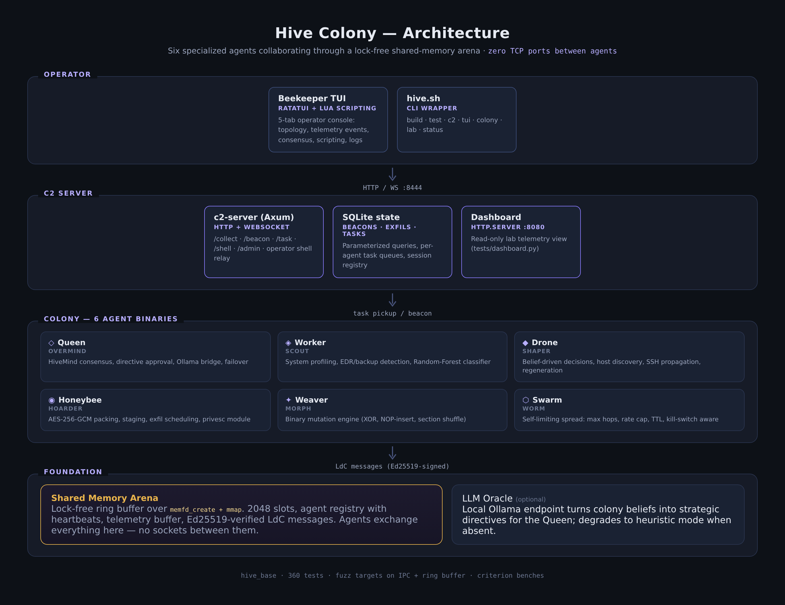

<p align="center">
  
</p>

<h1 align="center">🐝 Hive Colony v3.0</h1>

<p align="center">
  <strong>A multi-agent autonomous swarm framework in Rust</strong><br/>
  <sub>6 specialized agents · lock-free shared-memory IPC · zero TCP ports between agents · LLM-driven strategy</sub>
</p>

<p align="center">
  <a href="https://github.com/Ruby570bocadito/HiveMind/actions/workflows/ci.yml"></a>
  
  
  <a href="LICENSE"></a>
  
  
</p>

---

> [!IMPORTANT]
> **Research & education project.** Hive Colony is a distributed-systems
> engineering portfolio built around a security narrative. It is designed for
> **isolated lab environments that you own**. The shipped configuration runs
> with `safe_mode = true` and the exploits module **disabled**. Do not use it
> against systems you are not explicitly authorized to test.

## Why this project is interesting

- **Agents talk over shared memory, not sockets.** Every agent memory-maps the
  same arena (`memfd_create` + `mmap`) and exchanges Ed25519-signed LdC
  messages through a **lock-free ring buffer** — no agent opens a TCP port to
  talk to another agent.
- **A real consensus layer.** Directives need weighted-reputation voting
  across agents before anything executes; reputation decays over time and
  rehabilitates after good behavior.
- **Observability built in.** A structured telemetry pipeline (HTL events,
  criticality levels, rotating JSONL files with rotation on size *and* age),
  chaos-engineering recipes with replay, and an IPC contract validator with
  fuzz targets.
- **LLM optional, not required.** The Queen can consult a local Ollama model
  for strategy, and the whole colony degrades gracefully to heuristic mode
  when no model is present.
- **Tested like a library, not a script.** 360 tests, two criterion benches,
  and cargo-fuzz targets on the IPC and ring-buffer paths.

## Architecture



**The message path:** an agent publishes an LdC message → it lands in the
next ring-buffer slot of the shared arena (sequence numbers, per-slot
signatures) → every other agent's reader picks it up on its next poll →
consensus engine tallies it. The C2 server is the *operator* boundary
(HTTP + WebSocket on `:8444`), not the agent bus.

## Quick start

```bash
git clone https://github.com/Ruby570bocadito/HiveMind
cd HiveMind

./hive.sh build          # build all 11 crates
./hive.sh test           # run the hive_base test suite (360+ tests)

./hive.sh c2             # C2 server on http://localhost:8444
./hive.sh tui            # Beekeeper operator TUI (in another terminal)
```

Full lab via Docker (C2 + six agents + SSH targets + dashboard):

```bash
./hive.sh colony         # main stack
./hive.sh lab            # SSH target lab (see scripts/lab_setup.sh)
```

`hive.sh` is a thin wrapper over `cargo`/`docker compose` — plain cargo
works too:

```bash
cargo build --workspace
cargo test -p hive_base -- --test-threads=2
cargo run -p c2-server -- --port 8444
cargo run -p beekeeper
```

<p align="center">
  
</p>

## The colony

| Agent | Role | What it actually does |
|-------|------|----------------------|
| **Queen** | Overmind | HiveMind directive consensus, reputation ledger, Ollama LLM bridge, failover decisions |
| **Worker** | Scout | System profiling, EDR/backup process detection (8 signatures on Linux, 34 on Windows), embedded Random-Forest classifier with heuristic fallback |
| **Drone** | Shaper | Belief-driven decisions, host discovery, SSH propagation to lab targets, dead-agent regeneration |
| **Honeybee** | Hoarder | Simulation-only action executor (encrypt/exfil/destroy are hard-disabled by design), remote shell, privesc module |
| **Swarm** | Worm | Self-limiting spread: max hops, rate cap, TTL self-destruct, kill-switch aware |

Every agent:

- checks the colony-wide **kill switch** (`beekeeper kill-switch --confirm`)
  before anything else in its message loop,
- respects `hive.toml` (`HiveConfig::load()`) and its `[exploits] safe_mode`
  default of **true**,
- shuts down cleanly when the Queen dies (the "death dance").

## Engineering quality

| Area | Status |
|------|--------|
| Tests | **367 passing** — 326 unit + 41 integration (phase-A scenarios, arena regressions, no-TCP-port invariant; +9 new: C2 api-key auth, C2 rate limiter, config parse regressions) |
| CI | GitHub Actions: `cargo fmt --check`, `cargo clippy -D warnings`, full workspace build, release artifacts |
| Fuzzing | `cargo-fuzz` targets: IPC contract validation, ring-buffer ops |
| Benches | criterion: HTL throughput, IPC validation |
| Lints | zero clippy warnings across all 10 crates |
| Config | single `hive.toml`, loaded by every agent, loud failures on parse errors |

Repository layout:

```
hive_base/    shared library: arena IPC, LdC protocol, consensus, telemetry,
              config, tactics modules (67 modules)
agents/       queen · worker · drone · honeybee · swarm
c2/           Rust C2 server (axum + SQLite, :8444)
beekeeper/    operator TUI (ratatui + Lua scripting)
stinger/      dropper: fileless agent execution via memfd
buzz/         dev harness: boots a local colony, tears it down
training/     Python ML: dataset gen, RF classifier, DQN/PPO experiments
tests/        end-to-end lab scripts + Python reference C2
deploy/       Helm chart · docker compose labs
```

## Documentation

| Doc | Contents |
|-----|----------|
| [docs/README.md](docs/README.md) | documentation index & reading order |
| [docs/AGENTS.md](docs/AGENTS.md) | per-agent reference, message payloads, env vars |
| [docs/OPERATOR_GUIDE.md](docs/OPERATOR_GUIDE.md) | environment variables, TUI, subcommands |
| [docs/API.md](docs/API.md) | C2 HTTP/WS API (routes verified against code) |
| [docs/DEVELOPMENT.md](docs/DEVELOPMENT.md) | build, test, conventions |
| [docs/NAMING.md](docs/NAMING.md) | old ↔ current name mapping (Scout→Worker, …) |
| [ROADMAP.md](ROADMAP.md) | known gaps and planned work |

## Honest limitations

Kept public on purpose — a portfolio should know what it isn't:

- The Windows agent paths compile but have no CI coverage or tested artifacts.
- The C2 operator shell queues commands for agents (`/task/:agent_id`);
  the agent-side task poller is the next feature on the [roadmap](ROADMAP.md).
- `training/` ML scripts are real (sklearn/torch), but the converter from
  their export format to the runtime `.bin` model is pending — the shipped
  model is a pre-trained fixture.
- `rlua` is archived upstream; migration to `mlua` is tracked in the roadmap.
- Destructive actions are **hard-disabled**: honeybee's encrypt/exfiltrate/destroy
  paths only simulate (independent of `safe_mode`), and the overmind
  ransom-decision training dataset was removed from `training/` (2026-09-14).

## Security & ethics

- **Target only systems you own or have written authorization to test.**
- The repository ships `safe_mode = true`; enabling the exploits module is an
  explicit, per-lab decision documented in [docs/DEPLOYMENT.md](docs/DEPLOYMENT.md).
- All credentials in `docker/` are throwaway lab credentials; no secrets are
  committed (a lab SSH keypair is generated at image build time).
- The kill switch (`beekeeper kill-switch --confirm`) is the operator's
  emergency stop for every agent in the colony.

## License

MIT — see [LICENSE](LICENSE).
