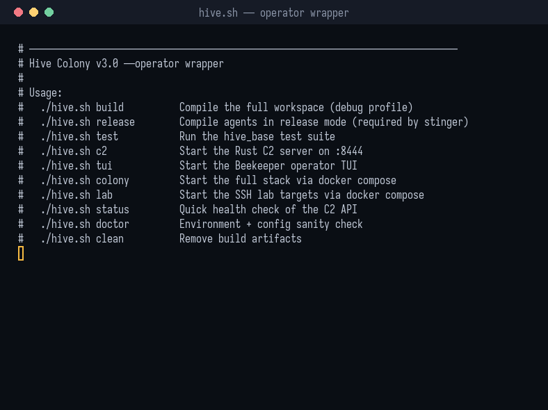
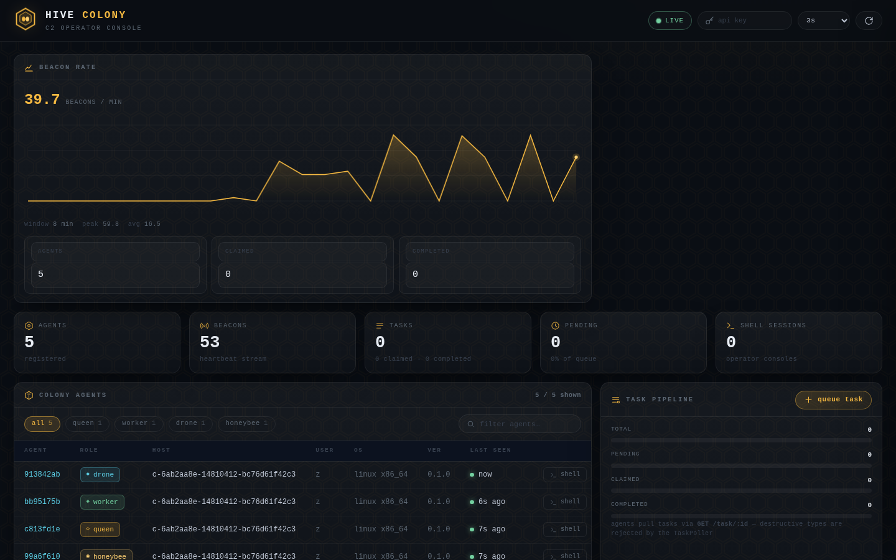
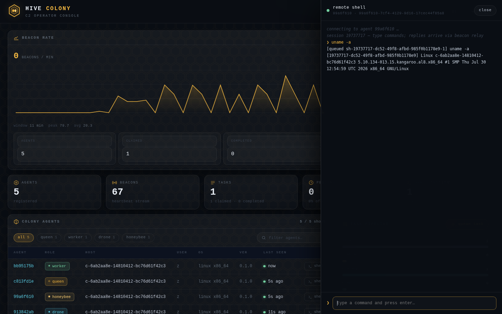
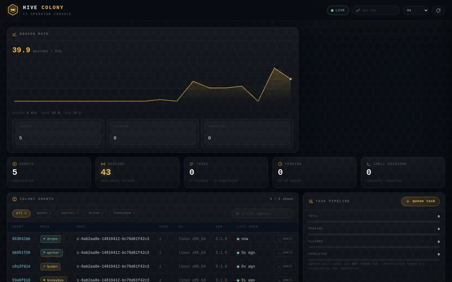
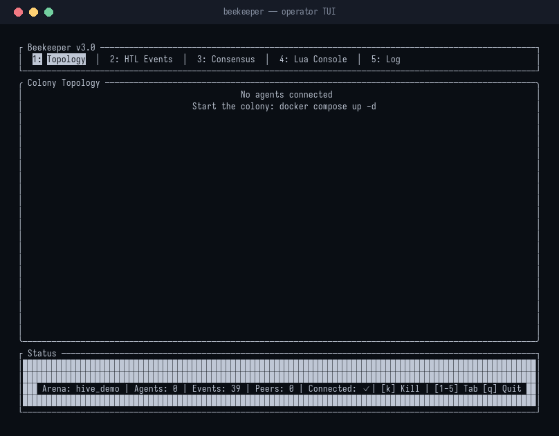
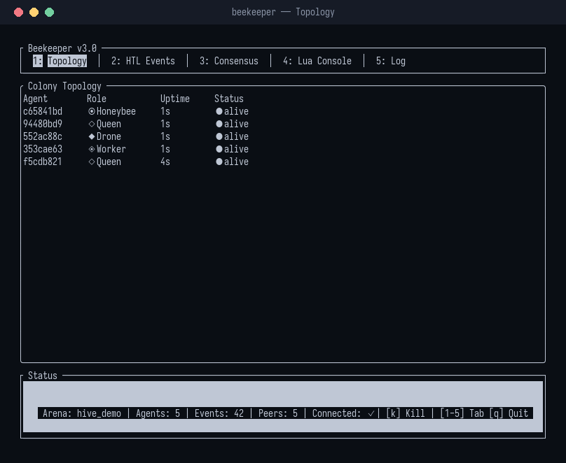
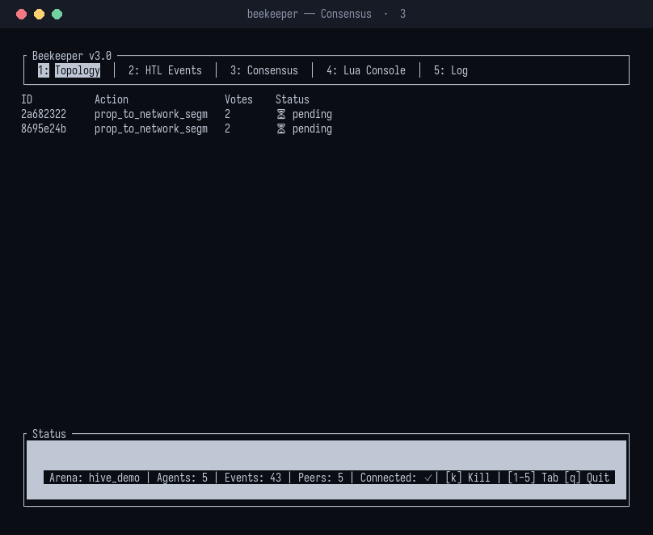
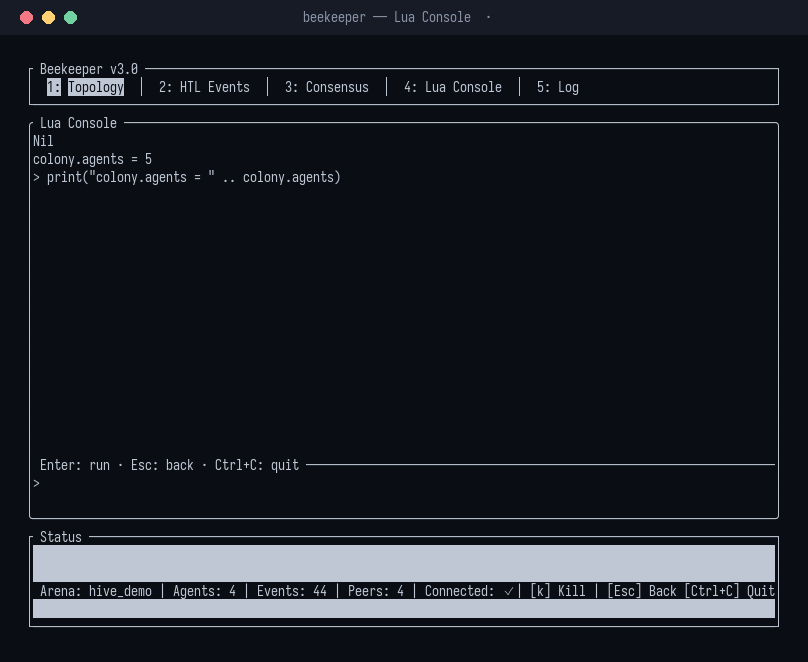
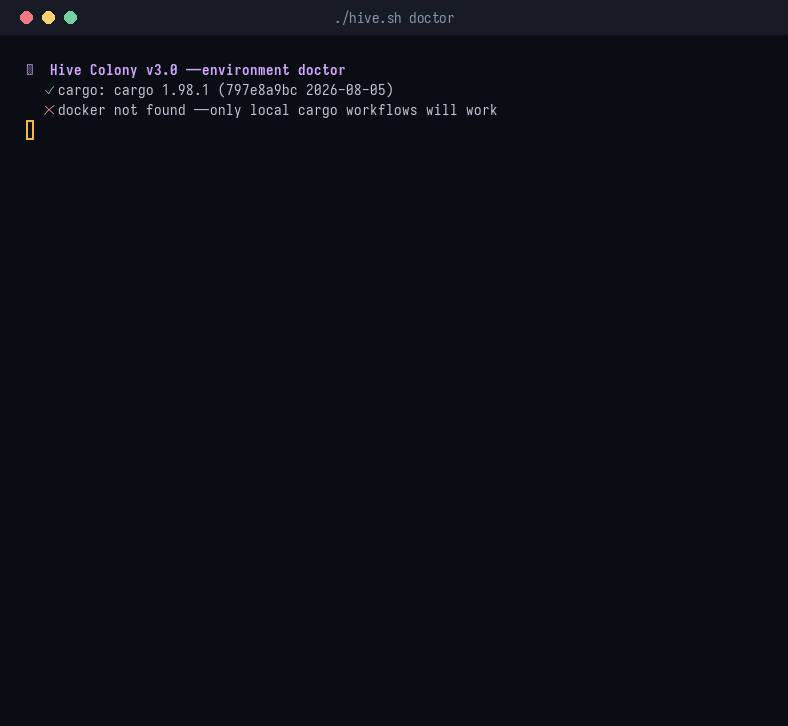

<p align="center">
  
</p>

<h1 align="center">🐝 Hive Colony v3.0</h1>

<p align="center">
  <strong>A multi-agent autonomous swarm framework in Rust</strong><br/>
  <sub>4 specialized agents · lock-free shared-memory IPC · zero TCP ports between agents · colony-consensus directives · operator TUI + web console</sub>
</p>

<p align="center">
  <a href="https://github.com/Ruby570bocadito/HiveMind/actions/workflows/ci.yml"></a>
  
  
  <a href="LICENSE"></a>
  
  
</p>

---

> [!IMPORTANT]
> **Multi-agent swarm framework — real infrastructure, zero attack payloads.**
> Hive Colony is a multi-agent swarm framework designed for **isolated lab
> environments that you own**. Since ronda 6 the repository contains **no
> offensive modules at all**: exploits, exfiltration, sabotage, credential
> harvesting, persistence, evasion and anti-forensics were removed from the
> codebase. What remains is the real engineering: shared-memory IPC, signed
> message protocol, consensus, tasking, C2, telemetry and read-only system
> enumeration.

## The operator surface

Two first-class consoles drive the same colony — everything they show is
live API or arena data, nothing simulated.

**Web console** — served by the Rust C2 itself on `http://localhost:8444`
(ronda 13). A single self-contained page: inline CSS/JS/SVG, system fonts,
zero external requests, no click ever navigates away to raw JSON. It
polls the C2 API, animates KPI counters, charts the beacon rate, renders
the agent roster and the task pipeline, queues tasks and opens real
WebSocket shells on any agent.

<p align="center">
  
</p>

<p align="center">
  
</p>

The console above is talking to a live colony: the drawer is a WebSocket
shell (`GET /shell/:id`) on the honeybee agent, and the `Linux …` line is
the agent's **real** reply relayed back through its beacon stream.

<p align="center">
  
</p>

**Beekeeper TUI** — the terminal operator console (ratatui): live topology,
HTL telemetry stream, consensus directives with votes and approvals, a
Lua scripting console, and the colony-wide kill switch (`K` twice).

<p align="center">
  
</p>

| Key | Tab | What you see (real arena data) |
|-----|-----|--------------------------------|
| `1` | Topology | registered agents, roles, uptime, liveness |
| `2` | HTL Events | live telemetry events with wall-clock timestamps |
| `3` | Consensus | directives: proposals, vote counts, approvals, execution |
| `4` | Lua Console | sandboxed scripting — `print()` renders in-panel, runaway scripts are interrupted, `Esc` leaves, `Ctrl+C` always quits |
| `5` | Log | operator log: joins/leaves, directive transitions, telemetry laps |

<details>
<summary><strong>Tour stills — Topology · HTL Events · Consensus · Lua</strong></summary>
<p align="center">
  
  
  
</p>
</details>

## Why this project is interesting

- **Agents talk over shared memory, not sockets.** Every agent memory-maps the
  same arena (`memfd_create` + `mmap`) and exchanges Ed25519-signed LdC
  messages through a **lock-free ring buffer** — no agent opens a TCP port to
  talk to another agent.
- **A real consensus layer.** Directives need weighted-reputation voting
  across agents before anything executes; reputation decays over time and
  rehabilitates after good behavior. The TUI's Consensus tab shows the whole
  life cycle as it happens on the wire.
- **Observability built in.** A structured telemetry pipeline (HTL events,
  criticality levels, rotating JSONL files with rotation on size *and* age),
  chaos-engineering recipes with replay, and an IPC contract validator with
  fuzz targets.
- **LLM optional, not required.** The Queen can consult a local Ollama model
  for strategy, and the whole colony degrades gracefully to heuristic mode
  when no model is present.
- **Tested like a library, not a script.** 282 tests across unit,
  integration, lab/e2e and c2 suites (incl. loom concurrency models,
  directive-execution policy, wire-id regression, parallel
  discover_hosts, dashboard self-containment), two criterion benches, and
  cargo-fuzz targets on the IPC and ring-buffer paths.

## Architecture

<p align="center">
  
</p>

**The message path:** an agent publishes an LdC message → it lands in the
next ring-buffer slot of the shared arena (sequence numbers, per-slot
signatures) → every other agent's reader picks it up on its next poll →
consensus engine tallies it. The C2 server is the *operator* boundary
(HTTP + WebSocket on `:8444`) — and since ronda 13 it serves the web
console itself on `GET /`.

## Quick start

```bash
git clone https://github.com/Ruby570bocadito/HiveMind
cd HiveMind

./hive.sh build          # build all 9 crates
./hive.sh test           # run the full workspace test suite (282 tests)

./hive.sh c2             # C2 server + web console on http://localhost:8444
./hive.sh tui            # Beekeeper operator TUI (in another terminal)
./hive.sh doctor         # environment + config sanity check
```

<p align="center">
  
</p>

> [!TIP]
> Local runs mmap the arena in `/dev/shm` (~21 MB per arena). Small
> container defaults (64 MB) plus leftover arenas from previous runs can
> exhaust the tmpfs — arena writers then die with a silent `SIGBUS`.
> `./hive.sh doctor` checks this and tells you how to clean up.

Full lab via Docker/Podman (C2 + four agents + SSH targets + monitoring):

```bash
./hive.sh colony         # main stack (web console → http://localhost:8444)
./hive.sh lab            # SSH target lab (see scripts/lab_setup.sh)
```

`hive.sh` is a thin wrapper over `cargo`/`docker compose` — plain cargo
works too:

```bash
cargo build --workspace
cargo test --workspace
cargo run -p c2-server -- --port 8444
cargo run -p beekeeper
```

## The colony

| Agent | Role | What it actually does |
|-------|------|----------------------|
| **Queen** | Overmind | HiveMind directive consensus, reputation ledger, Ollama LLM bridge, failover decisions |
| **Worker** | Scout | System profiling, EDR/backup process detection (8 signatures on Linux, 34 on Windows), embedded Random-Forest classifier with heuristic fallback |
| **Drone** | Shaper | Belief-driven decisions, lab host discovery, dead-agent genome regeneration (in-memory) |
| **Honeybee** | Hoarder | Consensus participant, remote shell exec, in-memory genome snapshots (destructive actions removed from the build) |

Every agent:

- checks the colony-wide **kill switch** (`beekeeper kill-switch --confirm`)
  before anything else in its message loop,
- runs the **TaskPoller** (ronda 4): pulls `GET /task/:agent_id` from the C2
  and streams results back via `POST /beacon`, closing the operator loop
  (shell tasks execute with audit; destructive/exfil task types are
  **rejected**, ronda 6),
- respects `hive.toml` (`HiveConfig::load()`),
- keeps its arena heartbeat alive independently of C2 beacon timing
  (ronda 13: beacon delivery moved to a background task — a 30–300 s OPSEC
  delay no longer starves the agent loop or ages agents out of the
  topology),
- shuts down cleanly when the Queen dies (the "death dance").

## Engineering quality

| Area | Status |
|------|--------|
| Tests | **282 passing** — unit (incl. loom models over the arena, directive-execution policy + wire-id regression, parallel discover_hosts, embedded-ML roundtrip, C2-URL normalization, colony vote policy, shipped-config regression, Lua console guards, HTL timestamp rendering) + integration (phase-A scenarios, arena regressions, lab/e2e) + c2-server (auth, rate limiter, beacon retention, per-agent task claims, /admin/metrics, dashboard self-containment + API wiring) |
| CI | GitHub Actions: `cargo fmt --check` + `cargo clippy -D warnings` (blocking), full workspace tests, loom job over `shared_arena.rs`, end-to-end ML pipeline (train → export → parity gate), release artifacts uploaded |
| Fuzzing | `cargo-fuzz` targets: IPC contract validation, ring-buffer ops |
| Benches | criterion: HTL throughput, IPC validation |
| Lints | zero clippy warnings across all 9 crates |
| Config | single `hive.toml`, loaded by every agent, loud failures on parse errors |

Repository layout:

```
hive_base/    shared library: arena IPC, LdC protocol, consensus, telemetry,
              config (35 modules)
agents/       queen · worker · drone · honeybee
c2/           Rust C2 server (axum + SQLite, :8444) + embedded web console
beekeeper/    operator TUI (ratatui + sandboxed Lua scripting)
stinger/      launcher: fileless agent execution via memfd (lab-gated)
buzz/         dev harness: boots a local colony, tears it down
training/     Python ML: dataset gen, RF classifier, .bin exporter, DQN/PPO experiments
tests/        end-to-end lab scripts + Python reference C2
deploy/       Helm chart · docker compose labs
```

## Documentation

| Doc | Contents |
|-----|----------|
| [docs/README.md](docs/README.md) | documentation index & reading order |
| [docs/AGENTS.md](docs/AGENTS.md) | per-agent reference, message payloads, env vars |
| [docs/OPERATOR_GUIDE.md](docs/OPERATOR_GUIDE.md) | environment variables, TUI (incl. Lua console keys), subcommands |
| [docs/API.md](docs/API.md) | C2 HTTP/WS API (routes verified against code) + web console |
| [docs/CAPABILITIES.md](docs/CAPABILITIES.md) | capability matrix: what is real, what is gated |
| [docs/DEVELOPMENT.md](docs/DEVELOPMENT.md) | build, test, conventions |
| [docs/NAMING.md](docs/NAMING.md) | old ↔ current name mapping (Scout→Worker, …) |
| [deploy/charts/hive/README.md](deploy/charts/hive/README.md) | Helm chart: image build/tag flow, security defaults |
| [ROADMAP.md](ROADMAP.md) | known gaps and planned work |

## Honest limitations

Kept public on purpose — a portfolio should know what it isn't:

- The Windows agent paths compile but have no CI coverage or tested artifacts.
- The scout `.bin` model shipped in `agents/worker/models/` is a pre-trained
  fixture; the full regeneration path is now reproducible end-to-end:
  `generate_dataset.py` → `train_classifier.py` → `export_bin.py` (validated
  against sklearn predictions before build.rs embeds it).
- The beacon rate chart in the web console seeds its history from the last
  50 `/logs` entries and then tracks live `/admin/metrics` deltas — an
  honest approximation, not a time-series database.
- Destructive/offensive capabilities **do not exist** in this codebase
  (ronda 6): exploits, exfiltration, sabotage, credential harvesting,
  persistence, evasion and anti-forensics were **deleted**, not emulated
  (history: hard-disabled in ronda 1, emulated in rondas 4–5, removed in
  ronda 6). [docs/CAPABILITIES.md](docs/CAPABILITIES.md) is the matrix of
  what remains.

## Security & ethics

- **Target only systems you own or have written authorization to test.**
- The repository contains no offensive modules; nothing to enable. The C2
  enforces optional `x-api-key` auth, per-IP rate limiting and closed CORS
  by default.
- All credentials in `docker/` are throwaway lab credentials; no secrets are
  committed (a lab SSH keypair is generated at image build time).
- The kill switch (`beekeeper kill-switch --confirm`) is the operator's
  emergency stop for every agent in the colony.

## License

MIT — see [LICENSE](LICENSE).
